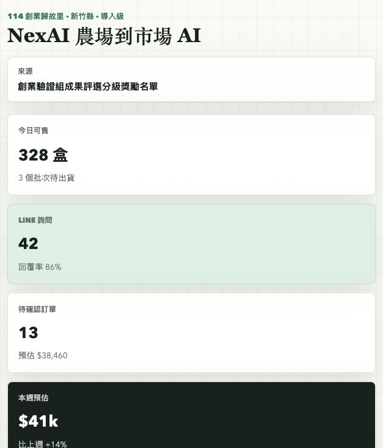
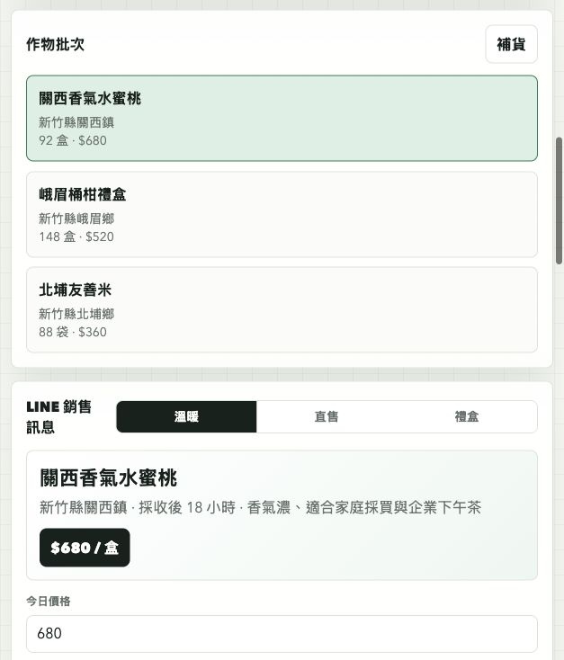

# NexAI Farm Market Assistant

## 快速看懂

- 線上 Demo：https://atlasforcn.github.io/startup-nexai-farm-market/
- 這個原型在做什麼：把 NexAI 做成基於 LINE 情境的農民銷售與行銷助理。
- 特色定位：特色是把農產品上架、客戶訊息、銷售建議與行銷文案放到同一個農務銷售畫面。
- 操作流程：建立農產品與庫存資料 → 查看 AI 銷售建議與客戶訊息 → 產生行銷文案並追蹤訂單狀態

展開完整功能流程截圖

這個 repo 是依據 `NexAI` 在創業歸故里驗證輔導計畫中的提案概念做出的前端原型。原型把「農場到市場 AI：基於 LINE 的農民銷售與行銷助理」實作成一個農民可操作的銷售工作台。

## 比賽來源

- 比賽/計畫：創業歸故里+驗證輔導計畫
- 年度：114 年
- 屆次/階段：創業驗證組成果評選分級獎勵名單
- 獎項等級：導入級
- 驗證縣市：新竹縣
- 公司/團隊名稱：NexAI
- 得獎作品/提案：農場到市場 AI：基於 LINE 的農民銷售與行銷助理
- 主辦：數位發展部數位產業署
- 官方來源：https://sccontest.tca.org.tw/content/display#sectionA

## 核心概念

農民或地方小農常有好產品，但缺乏穩定的線上銷售、客戶回覆、庫存整理與行銷文案能力。這個原型把概念拆成四個核心流程：

- 作物批次與庫存管理：記錄今日可售數量、價格、產地與商品亮點。
- LINE 銷售訊息助理：依客群與語氣產生可直接貼到 LINE 群組的銷售文案。
- 訂單看板：整理熟客、團購與店家訂單狀態。
- AI 營運建議：提示出貨風險、定價策略與通路節奏。

## 原型範圍

這是靜態前端原型，資料皆為模擬。它不代表原團隊正式產品，也未使用原團隊未公開資料、商標素材或後端服務。

## 使用方式

用瀏覽器開啟 `index.html`，或透過主整理網站的原型連結進入。

## 8 位專家補強

- 使用者與痛點：小農需要把零散庫存轉成可銷售內容，通路需要穩定規格、交期與回覆紀錄。
- 市場與差異：替代方案是 LINE 對話、社群貼文與批發市場；差異在庫存、客群、內容與訂單追蹤。早期客群從單一產銷班導入。
- 驗證：記錄場域上架、詢問轉換、訂單、缺貨、農民回饋、重複購買與銷售成效指標。
- 商業模式：農民或合作社依帳號付費訂閱，交易可收抽成；收入、訊息／模型成本、客服成本與毛利需報價驗證。
